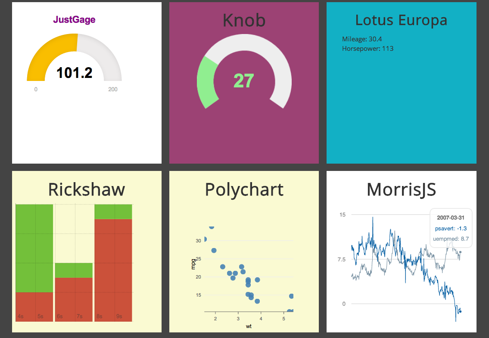

## Dashifyr

Dashifyr is an experimental dashboarding framework based on Shiny. It provides a highly modular plug-and-play infrastructure for creating high-quality dashboards. It supports multiple widgets (currently justgage, knob and handlebars), and is extensible. Interactive JS charts can be easily integrated into Dashifyr using [rCharts](http://github.com/ramnathv/rCharts) 



### Installation

Dashifyr requires the latest development versions of `httpuv`, `shiny` and `shinyGridster`. You can install these dependencies along with `dashifyr` using the following lines

```coffee
install.packages("httpuv", 
  repos=c(RStudio="http://rstudio.org/_packages", CRAN="http://cran.rstudio.com/"))
require(devtools)
install_github('shiny', 'rstudio')
install_github('shiny-gridster', 'wch')
install_github('dashifyr', 'ramnathv')
```

Note that you can also install `httpuv` from source, by following these instructions on the [github repo](https://github.com/rstudio/httpuv)

### Demo

Dashifyr comes with a demo app, which can be run using the following commands.

```coffee
require(dashifyr)
demoapp = system.file('demo', package = 'dashifyr')
shiny::runApp(demoapp)
```

### Credits

I would like to thank [Winston Chang](https://github.com/wch) for providing me with the inspiration for this dashboarding framework. I have borrowed extensively from his [shiny dashboard app demo](https://github.com/wch/shiny-jsdemo). I have also stolen ideas from the [dashing framework](https://github.com/shopify/dashing), to create a modular plug-and-play widget infrastructure, replacing the batman bindings with shiny bindings.


### License

Dashifyr is released under the MIT License. All R package dependencies and javascript libraries used by Dashifyr are licensed under their own terms. Please check before making use of them commercially.

### See More

Other interesting dashboarding libraries based on Shiny in the making are

- [ShinyDash by TresleTech](https://github.com/trestletech/ShinyDash)